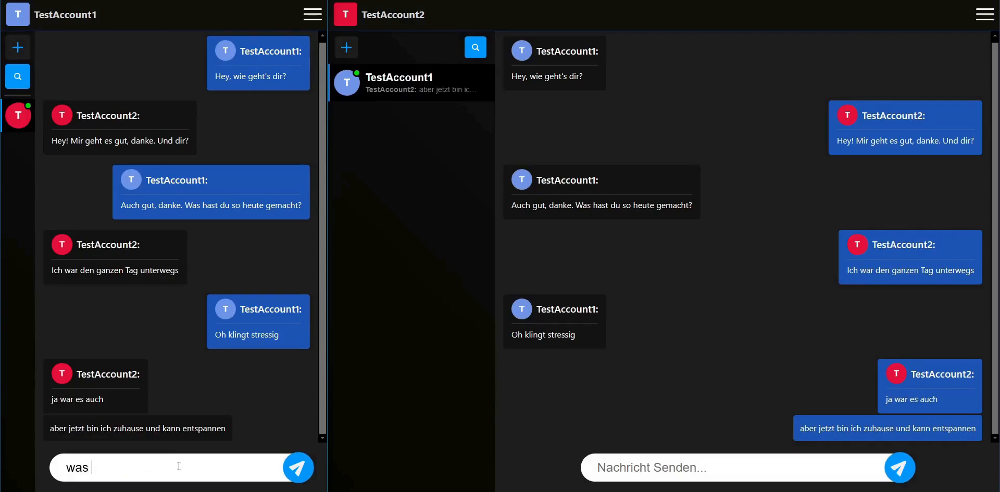

## EasyChat (Chat Anwendung)

## Ziel des Projekts
EasyChat ist ein privates Projekt, an dem
ich arbeite um verschiedenen
Technologien, wie z.B. Socket.IO (Websockets) oder JWT (JSON Web Tokens), zu
verstehen und die Richtige Anwendung zu lernen.

## Features/Todos
- [x] Einfache Authentifizierung (Registrieren, Anmelden)
- [x] Erstellen von Chats
- [x] Versenden von Nachrichten
- [x] Staus Anzeige

- [ ] Löschen von Chats
- [ ] Besseres User Feedback (Popups)
- [ ] Hochladen von Videos und Bildern
- [ ] Video/Audio Calls